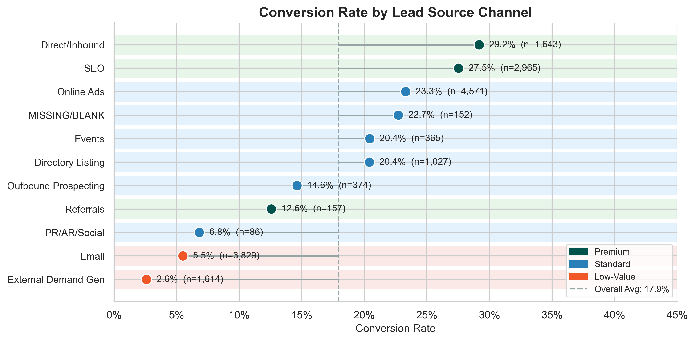

  <h1>MasterControl: QAL Lead Scoring &amp; Conversion Optimization</h1>
  
<strong>MSBA IS 6813 Capstone &nbsp;|&nbsp; University of Utah &nbsp;|&nbsp; Spring 2026</strong>

  

    
    
    
    
    
  

  
Thomas Beck &nbsp;·&nbsp; Max Ridgeway &nbsp;·&nbsp; Astha KC

## The Problem

MasterControl's SDRs work the QAL pipeline uniformly. Every lead gets the same attention regardless of how likely it is to convert. Mx converts at 12.6%, Qx at 19.7%, baseline 17.9%. The data contains clear signals that separate high-probability leads from low ones. The sales team is not using them.

---

## What We Recommend

Five actions that fall directly out of the analysis, ordered by confidence and ease of implementation.

**1. Score and tier every incoming QAL before SDR assignment.**
The voting ensemble ranks leads with a test AUC of 0.9147. Top-decile leads convert at 77.5%, a 4.3x lift over the 17.9% baseline. Operationalizing this requires a scored export from the model into the CRM, nothing more.

**2. Prioritize Pharma & Biotech accounts.**
Industry and manufacturing model are the second and third strongest predictors in SHAP. Pharma and Biotech organizations convert higher across seniority levels because regulatory compliance creates non-discretionary demand. Concentrating SDR effort here compounds.

**3. Engage senior contacts in Quality and Regulatory functions first.**
Seniority matters, but function matters as much as level. C-suite Regulatory converts at 43%, C-suite R&D at 50%, C-suite Quality at 21%. VP Quality converts at 31%. "Unknown" title records convert at 11.8%, well below baseline. Cleaning and enriching title data is a no-model improvement available today.

**4. Shift channel investment toward high-intent touchpoints.**
Intent strength is the single most predictive feature in the model. Webinars, personalized demos, and direct executive outreach outperform organic and email channels by a wide margin. Low-value channels are not just underperforming. They are introducing noise into the pipeline.

**5. Re-engage high-scoring recycled leads, filtered by score.**
Recycled leads make up the majority of the pipeline by volume and convert at roughly 13% overall, lower than first-touch at 19%. But the model scores recycled and active leads on the same scale. High-scoring recycled contacts represent recoverable pipeline at no incremental sourcing cost. Blanket re-engagement is not the recommendation. Filtered re-engagement is.

---

## What the Data Shows

| | |
|:---:|:---:|
|  |  |
| **Top SHAP predictors (VotingEnsemble)** | **Conversion rate by channel tier** |

**Seniority × Function conversion rates (from EDA):**

| Function | C-Suite | VP | Director | Manager |
|----------|---------|-----|----------|---------|
| Quality | 21% | 31% | 24% | 27% |
| Regulatory | 43% | 29% | 18% | 12% |
| R&D | 50% | 25% | 17% | 30% |
| PMO | 33% | . | 24% | 16% |
| Mfg/Ops | 20% | . | 12% | 20% |

VP and C-suite contacts in Regulatory and R&D are your highest-converting segments. Quality at VP (31%) is the most reliable high-volume opportunity.

---

## How the Model Works

16,816 QAL records from Salesforce CRM. Binary target: SQL / SQO / Won vs. Recycled / Disqualified. Positive class 17.9%. Accuracy is meaningless at this imbalance, so the primary metric is AUC-ROC.

Five gradient boosting models tuned via randomized search with 5-fold stratified cross-validation. SMOTE applied inside the CV pipeline, not before, to prevent synthetic-sample leakage across folds. Top candidates combined into a soft-voting ensemble. SHAP values explain each prediction in terms of the original features, so the sales team sees the reason, not just the score.

**Champion model:** VotingEnsemble. Test AUC 0.9147.

---

## Analysis

| Deliverable | Contents |
|-------------|----------|
| [EDA Notebook](notebooks/02_EDA/Thomas/MasterControl_EDA_vFinal.qmd) &nbsp;·&nbsp; [HTML](notebooks/02_EDA/Thomas/MasterControl_EDA_vFinal.html) | Funnel, conversion gap, channel breakdown, seniority × function heatmap |
| [Modeling Notebook](notebooks/03_Modeling/Thomas/mastercontrol_model_v13.qmd) | Feature engineering, model tournament, SHAP, score distribution |

> Raw data is not included in this repository.

---

## Team

| Member | Contribution |
|--------|-------------|
| **Thomas Beck** | Feature engineering, model training and selection, ensemble methods, SHAP analysis, EDA, notebook compilation |
| **Max Ridgeway** | Channel and industry segmentation, business validation |
| **Astha KC** | Calibration analysis, sponsor Q&A, documentation |
